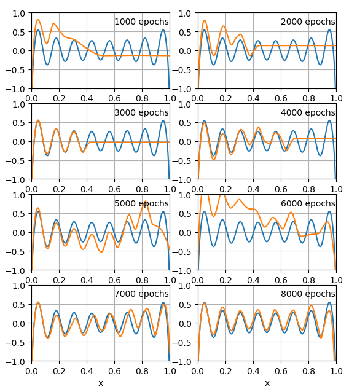

# PotFit
A PyTorch Example of Potential Fitting

## Problem
Provide there exists a potential V(x). Given some observations \{ V(x<sub>i</sub>), dV/dx(x<sub>i</sub>) \}<sub>i=1,...,N</sub>, obtain the approximate potential P(x) which satisfies L(V,P) &lt; &delta;, where

L(V,P) = (1/N) &sum;<sub>i</sub> ( |V(x<sub>i</sub>)-P(x<sub>i</sub>)|<sup>2</sup> + &lambda; |dV/dx(x<sub>i</sub>)-dP/dx(x<sub>i</sub>)|<sup>2</sup> ).

&delta; &gt; 0 and &lambda; &gt; 0, and they are gvien constants.


The values at N=100 random points are shown as solid cricles.

## Models
This code uses the neural networks as follows:

z<sup>0</sup> = &sigma;( x W<sub>in</sub> ),

z<sup>l</sup> = &sigma;( z<sup>l-1</sup> W<sup>l</sup> ) &nbsp; (l=1,...,L),

P(x) = z<sup>L</sup> W<sub>out</sub> + b<sub>out</sub>,

where &sigma;(x) = SSP(x) = Softplus(x) - Softplus(0).
W<sub>in</sub>, W<sup>l</sup>, and W<sub>out</sub> are the 1xH, HxH, and Hx1 matrices, respectively. 

The default setting: L=5 and H=500.

## Enviroment
* Python 3.7
* PyTorch 1.0.0.dev20181107
 
## How to run
```
python potfit.py --num_epochs 20000
```
This code uses &lambda; = 1/25.

You will eventually get outputs like as follows:
```
epoch 19995 lr 0.0003774 mse0 0.00228 mse1 2.07881 loss 0.08543
epoch 19996 lr 0.0003774 mse0 0.00557 mse1 2.85378 loss 0.11972
epoch 19997 lr 0.0003774 mse0 0.00285 mse1 4.02198 loss 0.16373
epoch 19998 lr 0.0003774 mse0 0.00476 mse1 4.44875 loss 0.18271
epoch 19999 lr 0.0003774 mse0 0.01051 mse1 2.68157 loss 0.11777
Best score: 0.007930990790831857
```
loss = mse0 + &lambda; mse1.

You can plot predictions of the best model as the following:
```
python plot_predictions.py best
```




## References
### **Deep Neural Networks**
Shiyu Liang and R. Srikant, "Why Deep Neural Networks for Function Approximation?", ICLR 2017 [link](https://arxiv.org/abs/1610.04161)
### **Softplus**
Vinod Nair and Geoffrey E. Hinton, "Rectified Linear Units Improve Restricted Boltzmann Machines", ICML 2010 [link](http://www.cs.toronto.edu/%7Ehinton/absps/reluICML.pdf)
### **Shifted Softplus (SSP)**
Kristof T. Schütt, Huziel E. Sauceda, Pieter-Jan Kindermans, Alexandre Tkatchenko, and Klaus-Robert Müller, "SchNet - a deep learning architecture for molecules and materials", J. Chem. Phys. 148, 241722 (2018) [link](https://arxiv.org/abs/1712.06113) 

## License

[Apache License 2.0](LICENSE)
